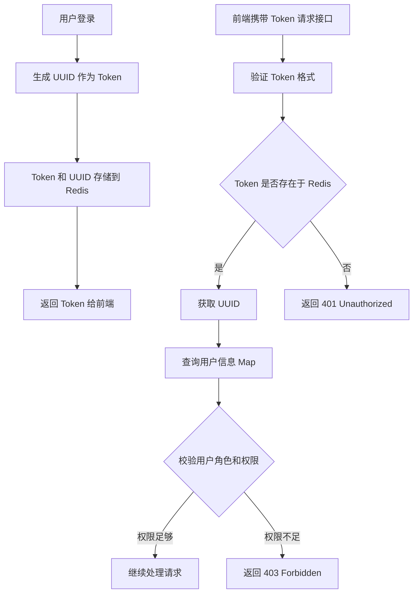

# 授权模块设计文档



## 1. 功能概述

授权模块旨在为系统提供基于 Bearer Token 的用户身份认证与权限管理功能。采用 **UUID** 作为 Token 标识符，通过 **Redis** 存储和解析 Token 对应的用户信息。模块核心功能包括：

- 验证前端发送的 Bearer Token 的有效性。
- 通过 Redis 获取 Token 对应的用户 UUID。
- 根据用户 UUID 检查用户信息 Map，校验用户角色权限。
- 对无效或过期的 Token 进行拦截，返回适当的错误响应。

---

## 2. 系统架构

### 2.1 模块架构

授权模块主要由以下部分组成：

1. **Token 生成模块**：
      - 在用户登录成功后生成一个 UUID 作为 Token。
      - 将生成的 Token 存储到 Redis，设定有效期。
2. **Token 验证模块**：
      - 验证前端发送的 Bearer Token 格式和有效性。
      - 通过 Redis 检查 Token 是否存在并获取用户 UUID。
3. **权限校验模块**：
      - 根据 UUID 查询用户信息 Map，检查用户的角色权限。
      - 根据用户角色权限进行分流限制。
4. **错误处理模块**：
      - 对于无效或过期的 Token，返回相应的错误状态（如 401 未授权）。

---

## 3. 设计目标与约束

### 3.1 设计目标

1. **安全性**：确保 Token 不可伪造和篡改。
2. **高效性**：利用 Redis 的快速查询能力，提升授权流程效率。
3. **扩展性**：支持多角色权限管理和分流限制。

### 3.2 系统约束

1. **Token 存储**：
      - Token 使用 UUID 格式，需保证唯一性。
      - Token 存储在 Redis 中，设置过期时间（如 1 天）。
2. **Redis 存储结构**：
      - Token-UUID 映射：`bearer:<token> -> <uuid>`
      - 用户信息 Map：`user:<uuid> -> {role: "admin", name: "user1", permissions: [...]}`
3. **权限管理**：
      - 支持角色（如 admin、user 等）和权限（如 read、write）两级校验。
      - 针对不同角色的权限分流，限制访问某些资源。

---

## 4. 核心流程

### 4.1 Token 生成流程

1. 用户登录时，后端生成一个 UUID 作为 Token。
2. 将 Token 和对应的用户 UUID 存储到 Redis，格式为：
   ```
   Key: bearer:<token>
   Value: <uuid>
   Expiration: 30 minutes
   ```
3. 将 Token 返回给前端，用于后续请求。

### 4.2 Token 验证流程

1. 前端在请求头中携带 Token，格式如下：
   ```
   Authorization: Bearer <token>
   ```
2. 后端验证 Token 格式是否合法。
3. 使用 Redis 查询 `bearer:<token>` 是否存在：
      - 如果存在，获取对应的用户 UUID。
      - 如果不存在，返回 `401 Unauthorized`，提示 Token 无效或已过期。

### 4.3 权限校验流程

1. 根据用户 UUID 查询用户信息 Map（如 `user:<uuid>`）。
2. 检查用户角色和权限是否符合当前请求的要求。
3. 如果权限不足，返回 `403 Forbidden`；否则继续处理请求。

---

## 5. 数据结构设计

### 5.1 Redis 键值设计

| Key 类型        | Key 示例                 | Value 示例                                             | 过期时间  |
| ------------- | ---------------------- | ---------------------------------------------------- | ----- |
| Token-UUID 映射 | `bearer:abcd1234-5678-ef90-ghij-klmnopqrstuv` | `abcd1234-5678-ef90-ghij-klmnopqrstuv`               | 30 分钟 |
| 用户信息 Map      | `user:abcd12345678ef90ghijklmnopqrstuv`   | `{role: "admin", name: "user1", permissions: [...]}` | 不设置过期 |

---

## 6. 错误处理设计

| 错误类型       | 错误代码 | 描述               | 解决方案                                 |
| ---------- | ---- | ---------------- | ------------------------------------ |
| Token 格式错误 | 400  | 请求头中未携带合法的 Token | 返回错误信息提示，要求客户端提供正确的 Bearer Token 格式。 |
| Token 无效   | 401  | Token 不存在或已过期    | 提示用户重新登录获取新的 Token。                  |
| 权限不足       | 403  | 用户角色或权限不足        | 返回权限不足提示，并说明所需的权限或角色要求。              |

---

## 7. 测试用例设计

### 7.1 Token 验证测试

| 测试场景       | 输入 Token                           | 预期结果                |
| ---------- | -------------------------------- | ------------------- |
| 合法 Token   | `bearer:abcd1234-5678-ef90-ghij-klmnopqrstuv` | 返回对应用户 UUID，状态 200。 |
| 非法格式 Token | `1234-5678-abcd`                   | 返回错误状态 400。         |
| 无效 Token   | `bearer:invalid-token-1234`       | 返回错误状态 401。         |
| 过期 Token   | `bearer:expired-token-5678`       | 返回错误状态 401。         |

### 7.2 权限校验测试

| 测试场景   | 用户角色    | 请求资源  | 预期结果           |
| ------ | ------- | ----- | -------------- |
| 用户权限匹配 | admin   | 管理员资源 | 返回状态 200，正常访问。 |
| 用户权限不足 | user    | 管理员资源 | 返回状态 403，权限不足。 |
| 未知用户角色 | unknown | 任意资源  | 返回状态 403，权限不足。 |

---

## 8. 总结

本授权模块设计采用前端 Bearer Token 验证，结合 Redis 进行快速解析和用户信息查询，能够高效地实现身份认证与权限管理。通过灵活的 Redis 数据结构和权限分流设计，确保系统的安全性与可扩展性。

