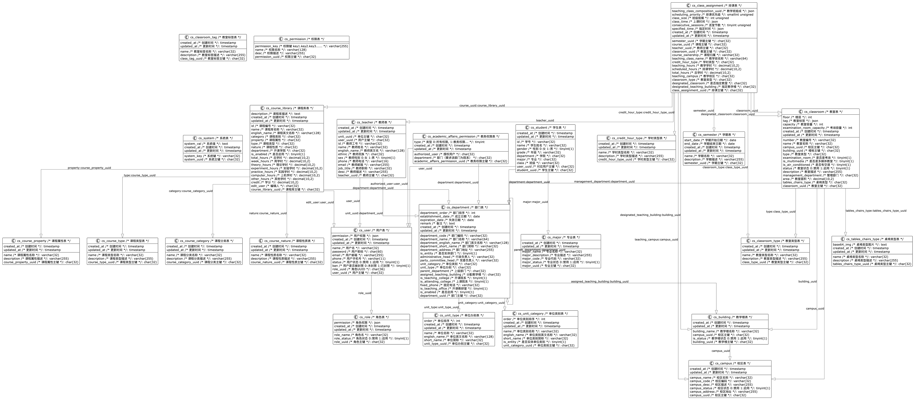

# 数据库设计

## 数据库快捷部署CLI

下载自己电脑系统的版本

[class-scheduling-system/table-install-cli](https://github.com/class-scheduling-system/table-install-cli/releases)

## 数据库结构图

## 数据库加载顺序

| 序号 | 名字                                 | 中文解释及用途              |
| ---- | ------------------------------------ | --------------------------- |
| 1    | `cs_system.sql`                      | 系统配置相关表              |
| 2    | `cs_permission.sql`                  | 权限管理表，用于权限配置    |
| 3    | `cs_role.sql`                        | 角色表，定义用户角色        |
| 4    | `cs_user.sql`                        | 用户表，存储用户信息        |
| 5    | `cs_unit_type.sql`                   | 单位类型表，例如学院/部门等 |
| 6    | `cs_unit_category.sql`               | 单位类别表，分类单位属性    |
| 7    | `cs_tables_chairs_type.sql`          | 桌椅类型表，定义教室桌椅    |
| 8    | `cs_semester.sql`                    | 学期表，存储学期信息        |
| 9    | `cs_major.sql`                       | 专业表，存储专业信息        |
| 10   | `cs_credit_hour_type.sql`            | 学时类型表，定义学时分类    |
| 11   | `cs_course_type.sql`                 | 课程类型表，例如必修/选修   |
| 12   | `cs_course_property.sql`             | 课程属性表，描述课程属性    |
| 13   | `cs_course_nature.sql`               | 课程性质表，例如理论/实践   |
| 14   | `cs_course_category.sql`             | 课程类别表，例如公共课等    |
| 15   | `cs_campus.sql`                      | 校区表，存储校区信息        |
| 16   | `cs_building.sql`                    | 教学楼表，存储教学楼信息    |
| 17   | `cs_department.sql`                  | 部门表，存储院系部门信息    |
| 18   | `cs_classroom_tag.sql`               | 教室标签表，用于教室分类    |
| 19   | `cs_classroom_type.sql`              | 教室类型表，例如实验室等    |
| 20   | `cs_classroom.sql`                   | 教室表，存储教室信息        |
| 21   | `cs_student.sql`                     | 学生表，存储学生基本信息    |
| 22   | `cs_teacher.sql`                     | 教师表，存储教师基本信息    |
| 23   | `cs_course_library.sql`              | 课程库表，存储课程基础信息  |
| 24   | `cs_academic_affairs_permission.sql` | 教务权限表，用于教务管理    |
| 25   | `cs_class_assignment.sql`            | 排课表，存储排课信息        |

## 数据库结构

### 系统表 (`cs_system`)

**用途**：存储系统配置信息。

#### 表结构

| 字段名        | 类型        | 是否为空 | 主键 | 默认值            | 描述                 |
| ------------- | ----------- | -------- | ---- | ----------------- | -------------------- |
| `system_uuid` | CHAR(32)    | 否       | 是   | 无                | 系统主键             |
| `system_key`  | VARCHAR(32) | 否       | 否   | 无                | 系统键               |
| `system_val`  | TEXT        | 是       | 否   | 无                | 系统值               |
| `created_at`  | TIMESTAMP   | 否       | 否   | CURRENT_TIMESTAMP | 创建时间             |
| `updated_at`  | TIMESTAMP   | 否       | 否   | CURRENT_TIMESTAMP | 更新时间（自动更新） |

#### 索引

| 索引名          | 类型     | 字段         | 描述           |
| --------------- | -------- | ------------ | -------------- |
| `uk_system_key` | 唯一索引 | `system_key` | 系统键唯一索引 |

### 权限表 (`cs_permission`)

**用途**：存储权限相关信息，用于系统权限管理。

#### 表结构

| 字段名            | 类型         | 是否为空 | 主键 | 默认值 | 描述                            |
| ----------------- | ------------ | -------- | ---- | ------ | ------------------------------- |
| `permission_uuid` | CHAR(32)     | 否       | 是   | 无     | 权限主键                        |
| `permission_key`  | VARCHAR(255) | 否       | 否   | 无     | 权限键，格式为 `key1.key2.key3` |
| `name`            | VARCHAR(128) | 否       | 否   | 无     | 权限名称                        |
| `desc`            | VARCHAR(255) | 是       | 否   | 无     | 权限描述                        |

#### 索引

| 索引名              | 类型     | 字段             | 描述           |
| ------------------- | -------- | ---------------- | -------------- |
| `uk_permission_key` | 唯一索引 | `permission_key` | 权限键唯一索引 |

### 角色表 (`cs_role`)

**用途**：存储用户角色信息，用于权限管理和角色分配。

#### 表结构

| 字段名        | 类型        | 是否为空 | 主键 | 默认值            | 描述                         |
| ------------- | ----------- | -------- | ---- | ----------------- | ---------------------------- |
| `role_uuid`   | CHAR(32)    | 否       | 是   | 无                | 角色主键                     |
| `role_name`   | VARCHAR(32) | 否       | 否   | 无                | 角色名                       |
| `role_status` | BOOLEAN     | 否       | 否   | TRUE              | 角色状态（0: 禁用，1: 启用） |
| `permission`  | JSON        | 是       | 否   | 无                | 角色权限                     |
| `created_at`  | TIMESTAMP   | 否       | 否   | CURRENT_TIMESTAMP | 创建时间                     |
| `updated_at`  | TIMESTAMP   | 否       | 否   | CURRENT_TIMESTAMP | 更新时间（自动更新）         |

#### 索引

| 索引名      | 类型     | 字段        | 描述           |
| ----------- | -------- | ----------- | -------------- |
| `role_name` | 唯一索引 | `role_name` | 角色名唯一索引 |

### 用户表 (`cs_user`)

**用途**：存储用户基本信息，用于系统用户管理。

#### 表结构

| 字段名       | 类型         | 是否为空 | 主键 | 默认值            | 描述                                   |
| ------------ | ------------ | -------- | ---- | ----------------- | -------------------------------------- |
| `user_uuid`  | CHAR(32)     | 否       | 是   | 无                | 用户主键                               |
| `name`       | VARCHAR(32)  | 否       | 否   | 无                | 用户名                                 |
| `password`   | CHAR(60)     | 否       | 否   | 无                | 用户密码                               |
| `email`      | VARCHAR(255) | 否       | 否   | 无                | 用户邮箱                               |
| `phone`      | VARCHAR(11)  | 否       | 否   | 无                | 用户手机号                             |
| `status`     | BOOLEAN      | 否       | 否   | TRUE              | 用户状态（0: 禁用，1: 启用）           |
| `ban`        | BOOLEAN      | 否       | 否   | FALSE             | 用户是否被封禁（0: 未封禁，1: 已封禁） |
| `role_uuid`  | CHAR(36)     | 否       | 否   | 无                | 角色 UUID                              |
| `permission` | JSON         | 否       | 否   | 无                | 用户权限                               |
| `created_at` | TIMESTAMP    | 否       | 否   | CURRENT_TIMESTAMP | 创建时间                               |
| `updated_at` | TIMESTAMP    | 否       | 否   | CURRENT_TIMESTAMP | 更新时间（自动更新）                   |

#### 索引

| 索引名          | 类型     | 字段    | 描述               |
| --------------- | -------- | ------- | ------------------ |
| `uk_user_email` | 唯一索引 | `email` | 用户邮箱唯一索引   |
| `uk_user_phone` | 唯一索引 | `phone` | 用户手机号唯一索引 |
| `uk_user_name`  | 唯一索引 | `name`  | 用户名唯一索引     |

#### 外键约束

| 外键名              | 字段        | 引用表    | 引用字段    | 删除策略 | 更新策略 |
| ------------------- | ----------- | --------- | ----------- | -------- | -------- |
| `fk_user_role_uuid` | `role_uuid` | `cs_role` | `role_uuid` | RESTRICT | CASCADE  |

### 单位类型表 (`cs_unit_type`)

**用途**：存储单位类型信息，例如学院、部门等分类。

#### 表结构

| 字段名           | 类型         | 是否为空 | 主键 | 默认值            | 描述                 |
| ---------------- | ------------ | -------- | ---- | ----------------- | -------------------- |
| `unit_type_uuid` | CHAR(32)     | 否       | 是   | 无                | 单位类型主键         |
| `name`           | VARCHAR(32)  | 否       | 否   | 无                | 单位名称             |
| `english_name`   | VARCHAR(128) | 是       | 否   | 无                | 单位英文名称         |
| `short_name`     | VARCHAR(32)  | 是       | 否   | 无                | 单位简称             |
| `order`          | INT          | 否       | 否   | 100               | 单位排序             |
| `created_at`     | TIMESTAMP    | 否       | 否   | CURRENT_TIMESTAMP | 创建时间             |
| `updated_at`     | TIMESTAMP    | 否       | 否   | CURRENT_TIMESTAMP | 更新时间（自动更新） |

#### 索引

| 索引名        | 类型     | 字段   | 描述             |
| ------------- | -------- | ------ | ---------------- |
| `name_UNIQUE` | 唯一索引 | `name` | 单位名称唯一索引 |

### 单位类别表 (`cs_unit_category`)

**用途**：存储单位类别信息，例如学术单位、行政单位等分类。

#### 表结构

| 字段名               | 类型        | 是否为空 | 主键 | 默认值            | 描述                 |
| -------------------- | ----------- | -------- | ---- | ----------------- | -------------------- |
| `unit_category_uuid` | CHAR(32)    | 否       | 是   | 无                | 单位类别主键         |
| `name`               | VARCHAR(32) | 否       | 否   | 无                | 单位类别名称         |
| `order`              | INT         | 否       | 否   | 100               | 单位类别排序         |
| `english_name`       | VARCHAR(32) | 是       | 否   | 无                | 单位类别英文名称     |
| `short_name`         | VARCHAR(32) | 是       | 否   | 无                | 单位类别简称         |
| `is_entity`          | BOOLEAN     | 否       | 否   | TRUE              | 是否实体单位类别     |
| `created_at`         | TIMESTAMP   | 否       | 否   | CURRENT_TIMESTAMP | 创建时间             |
| `updated_at`         | TIMESTAMP   | 否       | 否   | CURRENT_TIMESTAMP | 更新时间（自动更新） |

#### 索引

| 索引名        | 类型     | 字段   | 描述                 |
| ------------- | -------- | ------ | -------------------- |
| `name_UNIQUE` | 唯一索引 | `name` | 单位类别名称唯一索引 |

### 桌椅类型表 (`cs_tables_chairs_type`)

**用途**：存储教室使用的桌椅类型信息，用于描述不同类型的桌椅配置。

#### 表结构

| 字段名                    | 类型         | 是否为空 | 主键 | 默认值            | 描述                        |
| ------------------------- | ------------ | -------- | ---- | ----------------- | --------------------------- |
| `tables_chairs_type_uuid` | CHAR(32)     | 否       | 是   | 无                | 桌椅类型主键                |
| `name`                    | VARCHAR(32)  | 否       | 否   | 无                | 桌椅类型名称                |
| `description`             | VARCHAR(255) | 是       | 否   | 无                | 桌椅类型描述                |
| `base64_img`              | TEXT         | 是       | 否   | 无                | 桌椅类型图片（Base64 格式） |
| `created_at`              | TIMESTAMP    | 否       | 否   | CURRENT_TIMESTAMP | 创建时间                    |
| `updated_at`              | TIMESTAMP    | 否       | 否   | CURRENT_TIMESTAMP | 更新时间（自动更新）        |

#### 索引

| 索引名                       | 类型     | 字段   | 描述                 |
| ---------------------------- | -------- | ------ | -------------------- |
| `uk_tables_chairs_type_name` | 唯一索引 | `name` | 桌椅类型名称唯一索引 |

### 学期表 (`cs_semester`)

**用途**：存储学期信息，包括学期名称、描述和时间范围。

#### 表结构

| 字段名          | 类型         | 是否为空 | 主键 | 默认值            | 描述                 |
| --------------- | ------------ | -------- | ---- | ----------------- | -------------------- |
| `semester_uuid` | CHAR(32)     | 否       | 是   | 无                | 学期主键             |
| `name`          | VARCHAR(32)  | 否       | 否   | 无                | 学期名称             |
| `description`   | VARCHAR(255) | 是       | 否   | 无                | 学期描述             |
| `start_date`    | DATE         | 否       | 否   | 无                | 学期开始日期         |
| `end_date`      | DATE         | 否       | 否   | 无                | 学期结束日期         |
| `created_at`    | TIMESTAMP    | 否       | 否   | CURRENT_TIMESTAMP | 创建时间             |
| `updated_at`    | TIMESTAMP    | 否       | 否   | CURRENT_TIMESTAMP | 更新时间（自动更新） |

#### 索引

| 索引名             | 类型     | 字段   | 描述             |
| ------------------ | -------- | ------ | ---------------- |
| `uk_semester_name` | 唯一索引 | `name` | 学期名称唯一索引 |

### 专业表 (`cs_major`)

**用途**：存储专业信息，包括专业名称、描述及其状态。

#### 表结构

| 字段名              | 类型         | 是否为空 | 主键 | 默认值            | 描述                         |
| ------------------- | ------------ | -------- | ---- | ----------------- | ---------------------------- |
| `major_uuid`        | CHAR(32)     | 否       | 是   | 无                | 专业主键                     |
| `major_name`        | VARCHAR(32)  | 否       | 否   | 无                | 专业名称                     |
| `major_description` | VARCHAR(255) | 是       | 否   | 无                | 专业描述                     |
| `major_code`        | VARCHAR(32)  | 否       | 否   | 无                | 专业代码                     |
| `major_status`      | BOOLEAN      | 否       | 否   | TRUE              | 专业状态（0: 禁用，1: 启用） |
| `created_at`        | TIMESTAMP    | 否       | 否   | CURRENT_TIMESTAMP | 创建时间                     |
| `updated_at`        | TIMESTAMP    | 否       | 否   | CURRENT_TIMESTAMP | 更新时间（自动更新）         |

#### 索引

| 索引名          | 类型     | 字段         | 描述             |
| --------------- | -------- | ------------ | ---------------- |
| `uk_major_name` | 唯一索引 | `major_name` | 专业名称唯一索引 |
| `uk_major_code` | 唯一索引 | `major_code` | 专业代码唯一索引 |

### 学时类型表 (`cs_credit_hour_type`)

**用途**：存储学时类型信息，用于定义不同类型的学时分类。

#### 表结构

| 字段名                  | 类型         | 是否为空 | 主键 | 默认值            | 描述                 |
| ----------------------- | ------------ | -------- | ---- | ----------------- | -------------------- |
| `credit_hour_type_uuid` | CHAR(32)     | 否       | 是   | 无                | 学时类型主键         |
| `name`                  | VARCHAR(32)  | 否       | 否   | 无                | 学时类型名称         |
| `description`           | VARCHAR(255) | 是       | 否   | 无                | 学时类型描述         |
| `created_at`            | TIMESTAMP    | 否       | 否   | CURRENT_TIMESTAMP | 创建时间             |
| `updated_at`            | TIMESTAMP    | 否       | 否   | CURRENT_TIMESTAMP | 更新时间（自动更新） |

#### 索引

| 索引名                     | 类型     | 字段   | 描述                 |
| -------------------------- | -------- | ------ | -------------------- |
| `uk_credit_hour_type_name` | 唯一索引 | `name` | 学时类型名称唯一索引 |

### 课程类型表 (`cs_course_type`)

**用途**：存储课程类型信息，例如必修课、选修课等分类。

#### 表结构

| 字段名             | 类型         | 是否为空 | 主键 | 默认值            | 描述                 |
| ------------------ | ------------ | -------- | ---- | ----------------- | -------------------- |
| `course_type_uuid` | CHAR(32)     | 否       | 是   | 无                | 课程类型主键         |
| `name`             | VARCHAR(32)  | 否       | 否   | 无                | 课程类型名称         |
| `description`      | VARCHAR(255) | 是       | 否   | 无                | 课程类型描述         |
| `created_at`       | TIMESTAMP    | 否       | 否   | CURRENT_TIMESTAMP | 创建时间             |
| `updated_at`       | TIMESTAMP    | 否       | 否   | CURRENT_TIMESTAMP | 更新时间（自动更新） |

#### 索引

| 索引名                | 类型     | 字段   | 描述                 |
| --------------------- | -------- | ------ | -------------------- |
| `uk_course_type_name` | 唯一索引 | `name` | 课程类型名称唯一索引 |

### 课程属性表 (`cs_course_property`)

**用途**：存储课程的属性信息，例如课程的难度等级、应用领域等。

#### 表结构

| 字段名                 | 类型         | 是否为空 | 主键 | 默认值            | 描述                 |
| ---------------------- | ------------ | -------- | ---- | ----------------- | -------------------- |
| `course_property_uuid` | CHAR(32)     | 否       | 是   | 无                | 课程属性主键         |
| `name`                 | VARCHAR(32)  | 否       | 否   | 无                | 课程属性名称         |
| `description`          | VARCHAR(255) | 是       | 否   | 无                | 课程属性描述         |
| `created_at`           | TIMESTAMP    | 否       | 否   | CURRENT_TIMESTAMP | 创建时间             |
| `updated_at`           | TIMESTAMP    | 否       | 否   | CURRENT_TIMESTAMP | 更新时间（自动更新） |

#### 索引

| 索引名                    | 类型     | 字段   | 描述                 |
| ------------------------- | -------- | ------ | -------------------- |
| `uk_course_property_name` | 唯一索引 | `name` | 课程属性名称唯一索引 |

### 课程性质表 (`cs_course_nature`)

**用途**：存储课程性质信息，例如理论课程、实践课程等分类。

#### 表结构

| 字段名               | 类型         | 是否为空 | 主键 | 默认值            | 描述                 |
| -------------------- | ------------ | -------- | ---- | ----------------- | -------------------- |
| `course_nature_uuid` | CHAR(32)     | 否       | 是   | 无                | 课程性质主键         |
| `name`               | VARCHAR(32)  | 否       | 否   | 无                | 课程性质名称         |
| `description`        | VARCHAR(255) | 是       | 否   | 无                | 课程性质描述         |
| `created_at`         | TIMESTAMP    | 否       | 否   | CURRENT_TIMESTAMP | 创建时间             |
| `updated_at`         | TIMESTAMP    | 否       | 否   | CURRENT_TIMESTAMP | 更新时间（自动更新） |

#### 索引

| 索引名                  | 类型     | 字段   | 描述                 |
| ----------------------- | -------- | ------ | -------------------- |
| `uk_course_nature_name` | 唯一索引 | `name` | 课程性质名称唯一索引 |

### 课程分类表 (`cs_course_category`)

**用途**：存储课程的分类信息，例如公共课、专业课等。

#### 表结构

| 字段名                 | 类型         | 是否为空 | 主键 | 默认值            | 描述                 |
| ---------------------- | ------------ | -------- | ---- | ----------------- | -------------------- |
| `course_category_uuid` | CHAR(32)     | 否       | 是   | 无                | 课程分类主键         |
| `name`                 | VARCHAR(32)  | 否       | 否   | 无                | 课程分类名称         |
| `description`          | VARCHAR(255) | 是       | 否   | 无                | 课程分类描述         |
| `created_at`           | TIMESTAMP    | 否       | 否   | CURRENT_TIMESTAMP | 创建时间             |
| `updated_at`           | TIMESTAMP    | 否       | 否   | CURRENT_TIMESTAMP | 更新时间（自动更新） |

#### 索引

| 索引名                    | 类型     | 字段   | 描述                 |
| ------------------------- | -------- | ------ | -------------------- |
| `uk_course_category_name` | 唯一索引 | `name` | 课程分类名称唯一索引 |

### 课程库表 (`cs_course_library`)

**用途**：存储课程的基础信息，例如课程编号、名称、类别等。

#### 表结构

| 字段名                | 类型          | 是否为空 | 主键 | 默认值            | 描述                 |
| --------------------- | ------------- | -------- | ---- | ----------------- | -------------------- |
| `course_library_uuid` | CHAR(32)      | 否       | 是   | 无                | 课程库主键           |
| `id`                  | VARCHAR(32)   | 否       | 否   | 无                | 课程编号             |
| `name`                | VARCHAR(32)   | 否       | 否   | 无                | 课程库名称           |
| `english_name`        | VARCHAR(128)  | 否       | 否   | 无                | 课程英文名称         |
| `category`            | CHAR(32)      | 否       | 否   | 无                | 课程类别             |
| `property`            | CHAR(32)      | 否       | 否   | 无                | 课程属性             |
| `type`                | CHAR(32)      | 否       | 否   | 无                | 课程类型             |
| `nature`              | CHAR(32)      | 否       | 否   | 无                | 课程性质             |
| `department`          | CHAR(32)      | 否       | 否   | 无                | 开课学院             |
| `is_enabled`          | BOOLEAN       | 否       | 否   | TRUE              | 是否启用             |
| `total_hours`         | DECIMAL(10,2) | 否       | 否   | 0                 | 总学时               |
| `week_hours`          | DECIMAL(10,2) | 否       | 否   | 0                 | 周学时               |
| `theory_hours`        | DECIMAL(10,2) | 否       | 否   | 0                 | 理论学时             |
| `experiment_hours`    | DECIMAL(10,2) | 否       | 否   | 0                 | 实验学时             |
| `practice_hours`      | DECIMAL(10,2) | 否       | 否   | 0                 | 实践学时             |
| `computer_hours`      | DECIMAL(10,2) | 否       | 否   | 0                 | 上机学时             |
| `other_hours`         | DECIMAL(10,2) | 否       | 否   | 0                 | 其他学时             |
| `credit`              | DECIMAL(10,2) | 否       | 否   | 0                 | 学分                 |
| `description`         | TEXT          | 是       | 否   | 无                | 课程库描述           |
| `edit_user`           | CHAR(32)      | 是       | 否   | 无                | 编辑人               |
| `created_at`          | TIMESTAMP     | 否       | 否   | CURRENT_TIMESTAMP | 创建时间             |
| `updated_at`          | TIMESTAMP     | 否       | 否   | CURRENT_TIMESTAMP | 更新时间（自动更新） |

#### 索引

| 索引名                   | 类型     | 字段   | 描述               |
| ------------------------ | -------- | ------ | ------------------ |
| `uk_course_library_id`   | 唯一索引 | `id`   | 课程编号唯一索引   |
| `uk_course_library_name` | 唯一索引 | `name` | 课程库名称唯一索引 |

#### 外键约束

| 外键名                         | 字段         | 引用表               | 引用字段               | 描述         |
| ------------------------------ | ------------ | -------------------- | ---------------------- | ------------ |
| `fk_course_library_category`   | `category`   | `cs_course_category` | `course_category_uuid` | 课程类别外键 |
| `fk_course_library_property`   | `property`   | `cs_course_property` | `course_property_uuid` | 课程属性外键 |
| `fk_course_library_type`       | `type`       | `cs_course_type`     | `course_type_uuid`     | 课程类型外键 |
| `fk_course_library_nature`     | `nature`     | `cs_course_nature`   | `course_nature_uuid`   | 课程性质外键 |
| `fk_course_library_department` | `department` | `cs_department`      | `department_uuid`      | 开课学院外键 |
| `fk_course_library_edit_user`  | `edit_user`  | `cs_user`            | `user_uuid`            | 编辑人外键   |

### 校区表 (`cs_campus`)

**用途**：存储校区的基础信息，例如校区名称、编码和地址等。

#### 表结构

| 字段名           | 类型         | 是否为空 | 主键 | 默认值            | 描述                         |
| ---------------- | ------------ | -------- | ---- | ----------------- | ---------------------------- |
| `campus_uuid`    | CHAR(32)     | 否       | 是   | 无                | 校区主键                     |
| `campus_name`    | VARCHAR(32)  | 否       | 否   | 无                | 校区名称                     |
| `campus_code`    | VARCHAR(32)  | 否       | 否   | 无                | 校区编码                     |
| `campus_desc`    | VARCHAR(255) | 是       | 否   | 无                | 校区描述                     |
| `campus_status`  | BOOLEAN      | 否       | 否   | TRUE              | 校区状态（0: 禁用，1: 启用） |
| `campus_address` | VARCHAR(255) | 否       | 否   | 无                | 校区地址                     |
| `created_at`     | TIMESTAMP    | 否       | 否   | CURRENT_TIMESTAMP | 创建时间                     |
| `updated_at`     | TIMESTAMP    | 否       | 否   | CURRENT_TIMESTAMP | 更新时间（自动更新）         |

#### 索引

| 索引名           | 类型     | 字段          | 描述             |
| ---------------- | -------- | ------------- | ---------------- |
| `uk_campus_name` | 唯一索引 | `campus_name` | 校区名称唯一索引 |
| `uk_campus_code` | 唯一索引 | `campus_code` | 校区编码唯一索引 |

### 教学楼表 (`cs_building`)

**用途**：存储教学楼的基本信息，包括名称、所属校区等。

#### 表结构

| 字段名          | 类型        | 是否为空 | 主键 | 默认值            | 描述                           |
| --------------- | ----------- | -------- | ---- | ----------------- | ------------------------------ |
| `building_uuid` | CHAR(32)    | 否       | 是   | 无                | 教学楼主键                     |
| `building_name` | VARCHAR(32) | 否       | 否   | 无                | 教学楼名称                     |
| `campus_uuid`   | CHAR(32)    | 否       | 否   | 无                | 校区主键                       |
| `is_status`     | BOOLEAN     | 否       | 否   | TRUE              | 教学楼状态（0: 禁用，1: 启用） |
| `created_at`    | TIMESTAMP   | 否       | 否   | CURRENT_TIMESTAMP | 创建时间                       |
| `updated_at`    | TIMESTAMP   | 否       | 否   | CURRENT_TIMESTAMP | 更新时间（自动更新）           |

#### 索引

无额外索引。

#### 外键约束

| 外键名                     | 字段          | 引用表      | 引用字段      | 删除策略 | 更新策略 |
| -------------------------- | ------------- | ----------- | ------------- | -------- | -------- |
| `fk_cs_building_cs_campus` | `campus_uuid` | `cs_campus` | `campus_uuid` | RESTRICT | CASCADE  |

### 部门表 (`cs_department`)

**用途**：存储部门信息，包括院系、行政部门等的详细信息。

#### 表结构

| 字段名                       | 类型         | 是否为空 | 主键 | 默认值            | 描述           |
| ---------------------------- | ------------ | -------- | ---- | ----------------- | -------------- |
| `department_uuid`            | CHAR(32)     | 否       | 是   | 无                | 部门主键       |
| `department_code`            | VARCHAR(32)  | 否       | 否   | 无                | 部门编码       |
| `department_name`            | VARCHAR(64)  | 否       | 否   | 无                | 部门名称       |
| `department_order`           | INT          | 否       | 否   | 100               | 部门排序       |
| `department_english_name`    | VARCHAR(128) | 是       | 否   | 无                | 部门英文名称   |
| `department_short_name`      | VARCHAR(32)  | 是       | 否   | 无                | 部门简称       |
| `department_address`         | VARCHAR(255) | 是       | 否   | 无                | 部门地址       |
| `is_entity`                  | BOOLEAN      | 否       | 否   | TRUE              | 是否实体部门   |
| `administrative_head`        | VARCHAR(32)  | 是       | 否   | 无                | 行政负责人     |
| `party_committee_head`       | VARCHAR(32)  | 是       | 否   | 无                | 党委负责人     |
| `establishment_date`         | DATE         | 否       | 否   | 当前日期          | 成立日期       |
| `expiration_date`            | DATE         | 是       | 否   | 无                | 失效日期       |
| `unit_category`              | CHAR(32)     | 否       | 否   | 无                | 单位类别       |
| `unit_type`                  | CHAR(32)     | 否       | 否   | 无                | 单位办别       |
| `parent_department`          | CHAR(32)     | 是       | 否   | 无                | 上级部门       |
| `assigned_teaching_building` | CHAR(32)     | 是       | 否   | 无                | 分配教学楼     |
| `is_teaching_college`        | BOOLEAN      | 否       | 否   | TRUE              | 是否开课院系   |
| `is_attending_college`       | BOOLEAN      | 否       | 否   | TRUE              | 是否上课院系   |
| `fixed_phone`                | VARCHAR(32)  | 是       | 否   | 无                | 固定电话       |
| `remark`                     | TEXT         | 是       | 否   | 无                | 备注           |
| `is_teaching_office`         | BOOLEAN      | 否       | 否   | FALSE             | 是否开课教研室 |
| `is_enabled`                 | BOOLEAN      | 否       | 否   | TRUE              | 是否启用       |
| `created_at`                 | TIMESTAMP    | 否       | 否   | CURRENT_TIMESTAMP | 创建时间       |
| `updated_at`                 | TIMESTAMP    | 否       | 否   | CURRENT_TIMESTAMP | 更新时间       |

#### 索引

| 索引名               | 类型     | 字段              | 描述             |
| -------------------- | -------- | ----------------- | ---------------- |
| `uk_department_code` | 唯一索引 | `department_code` | 部门编码唯一索引 |

#### 外键约束

| 外键名                                     | 字段                         | 引用表             | 引用字段             | 删除策略 | 更新策略 |
| ------------------------------------------ | ---------------------------- | ------------------ | -------------------- | -------- | -------- |
| `fk_department_unit_category`              | `unit_category`              | `cs_unit_category` | `unit_category_uuid` | RESTRICT | CASCADE  |
| `fk_department_unit_type`                  | `unit_type`                  | `cs_unit_type`     | `unit_type_uuid`     | RESTRICT | CASCADE  |
| `fk_department_parent_department`          | `parent_department`          | `cs_department`    | `department_uuid`    | RESTRICT | CASCADE  |
| `fk_department_assigned_teaching_building` | `assigned_teaching_building` | `cs_building`      | `building_uuid`      | RESTRICT | CASCADE  |

### 教室类型表 (`cs_classroom_type`)

**用途**：存储教室类型信息，例如普通教室、实验室、会议室等。

#### 表结构

| 字段名            | 类型         | 是否为空 | 主键 | 默认值            | 描述                 |
| ----------------- | ------------ | -------- | ---- | ----------------- | -------------------- |
| `class_type_uuid` | CHAR(32)     | 否       | 是   | 无                | 教室类型主键         |
| `name`            | VARCHAR(32)  | 否       | 否   | 无                | 教室类型名称         |
| `description`     | VARCHAR(255) | 是       | 否   | 无                | 教室类型描述         |
| `created_at`      | TIMESTAMP    | 否       | 否   | CURRENT_TIMESTAMP | 创建时间             |
| `updated_at`      | TIMESTAMP    | 否       | 否   | CURRENT_TIMESTAMP | 更新时间（自动更新） |

#### 索引

| 索引名                   | 类型     | 字段   | 描述                 |
| ------------------------ | -------- | ------ | -------------------- |
| `uk_classroom_type_name` | 唯一索引 | `name` | 教室类型名称唯一索引 |

### 教室标签表 (`cs_classroom_tag`)

**用途**：存储教室的标签信息，用于教室分类和标记。

#### 表结构

| 字段名           | 类型         | 是否为空 | 主键 | 默认值            | 描述                 |
| ---------------- | ------------ | -------- | ---- | ----------------- | -------------------- |
| `class_tag_uuid` | CHAR(32)     | 否       | 是   | 无                | 教室标签主键         |
| `name`           | VARCHAR(32)  | 否       | 否   | 无                | 教室标签名称         |
| `description`    | VARCHAR(255) | 是       | 否   | 无                | 教室标签描述         |
| `created_at`     | TIMESTAMP    | 否       | 否   | CURRENT_TIMESTAMP | 创建时间             |
| `updated_at`     | TIMESTAMP    | 否       | 否   | CURRENT_TIMESTAMP | 更新时间（自动更新） |

#### 索引

| 索引名                  | 类型     | 字段   | 描述                 |
| ----------------------- | -------- | ------ | -------------------- |
| `uk_classroom_tag_name` | 唯一索引 | `name` | 教室标签名称唯一索引 |

### 教室表 (`cs_classroom`)

**用途**：存储教室的基本信息，包括教室编号、名称、位置、类型等详细信息。

#### 表结构

| 字段名                      | 类型          | 是否为空 | 主键 | 默认值            | 描述                         |
| --------------------------- | ------------- | -------- | ---- | ----------------- | ---------------------------- |
| `classroom_uuid`            | CHAR(32)      | 否       | 是   | 无                | 教室主键                     |
| `number`                    | VARCHAR(32)   | 否       | 否   | 无                | 教室编号                     |
| `name`                      | VARCHAR(32)   | 否       | 否   | 无                | 教室名称                     |
| `campus_uuid`               | CHAR(32)      | 否       | 否   | 无                | 校区主键                     |
| `building_uuid`             | CHAR(32)      | 否       | 否   | 无                | 楼栋主键                     |
| `floor`                     | INT           | 否       | 否   | 无                | 楼层                         |
| `type`                      | CHAR(32)      | 否       | 否   | 无                | 教室类型                     |
| `tag`                       | JSON          | 是       | 否   | 无                | 教室标签                     |
| `capacity`                  | INT           | 否       | 否   | 无                | 教室容量                     |
| `examination_room`          | BOOLEAN       | 否       | 否   | FALSE             | 是否是考场                   |
| `examination_room_capacity` | INT           | 是       | 否   | 无                | 考场容量                     |
| `is_multimedia`             | BOOLEAN       | 否       | 否   | FALSE             | 是否是多媒体教室             |
| `is_air_conditioned`        | BOOLEAN       | 否       | 否   | FALSE             | 是否有空调                   |
| `status`                    | BOOLEAN       | 否       | 否   | TRUE              | 教室状态（0: 禁用，1: 启用） |
| `description`               | VARCHAR(255)  | 是       | 否   | 无                | 教室描述                     |
| `management_department`     | CHAR(32)      | 是       | 否   | 无                | 管理部门                     |
| `area`                      | DECIMAL(10,2) | 否       | 否   | 无                | 教室面积（平方米）           |
| `tables_chairs_type`        | CHAR(32)      | 是       | 否   | 无                | 桌椅类型                     |
| `created_at`                | TIMESTAMP     | 否       | 否   | CURRENT_TIMESTAMP | 创建时间                     |
| `updated_at`                | TIMESTAMP     | 否       | 否   | CURRENT_TIMESTAMP | 更新时间（自动更新）         |

#### 索引

| 索引名                | 类型     | 字段     | 描述             |
| --------------------- | -------- | -------- | ---------------- |
| `uk_classroom_number` | 唯一索引 | `number` | 教室编号唯一索引 |

#### 外键约束

| 外键名                                     | 字段                    | 引用表                  | 引用字段                  | 删除策略 | 更新策略 |
| ------------------------------------------ | ----------------------- | ----------------------- | ------------------------- | -------- | -------- |
| `fk_cs_classroom_cs_campus`                | `campus_uuid`           | `cs_campus`             | `campus_uuid`             | RESTRICT | CASCADE  |
| `fk_cs_classroom_cs_building`              | `building_uuid`         | `cs_building`           | `building_uuid`           | RESTRICT | CASCADE  |
| `fk_cs_classroom_cs_classroom_type`        | `type`                  | `cs_classroom_type`     | `class_type_uuid`         | RESTRICT | CASCADE  |
| `fk_cs_classroom_cs_management_department` | `management_department` | `cs_department`         | `department_uuid`         | RESTRICT | CASCADE  |
| `fk_cs_classroom_cs_tables_chairs_type`    | `tables_chairs_type`    | `cs_tables_chairs_type` | `tables_chairs_type_uuid` | RESTRICT | CASCADE  |

### 学生表 (`cs_student`)

**用途**：存储学生的基本信息，包括学号、姓名、性别、所属院系、专业和班级等。

#### 表结构

| 字段名         | 类型        | 是否为空 | 主键 | 默认值            | 描述                 |
| -------------- | ----------- | -------- | ---- | ----------------- | -------------------- |
| `student_uuid` | CHAR(32)    | 否       | 是   | 无                | 学生主键             |
| `id`           | VARCHAR(32) | 否       | 否   | 无                | 学号                 |
| `name`         | VARCHAR(32) | 否       | 否   | 无                | 学生姓名             |
| `gender`       | BOOLEAN     | 否       | 否   | 无                | 性别（0: 女，1: 男） |
| `grade`        | VARCHAR(32) | 否       | 否   | 无                | 年级                 |
| `department`   | CHAR(32)    | 否       | 否   | 无                | 所属学院             |
| `major`        | CHAR(32)    | 否       | 否   | 无                | 所属专业             |
| `class`        | VARCHAR(32) | 否       | 否   | 无                | 班级                 |
| `user_uuid`    | CHAR(32)    | 是       | 否   | 无                | 对应用户主键         |
| `created_at`   | TIMESTAMP   | 否       | 否   | CURRENT_TIMESTAMP | 创建时间             |
| `updated_at`   | TIMESTAMP   | 否       | 否   | CURRENT_TIMESTAMP | 更新时间（自动更新） |

#### 索引

| 索引名          | 类型     | 字段 | 描述         |
| --------------- | -------- | ---- | ------------ |
| `uk_student_id` | 唯一索引 | `id` | 学号唯一索引 |

#### 外键约束

| 外键名                        | 字段         | 引用表          | 引用字段          | 删除策略 | 更新策略 |
| ----------------------------- | ------------ | --------------- | ----------------- | -------- | -------- |
| `fk_cs_student_cs_department` | `department` | `cs_department` | `department_uuid` | RESTRICT | CASCADE  |
| `fk_cs_student_cs_major`      | `major`      | `cs_major`      | `major_uuid`      | RESTRICT | CASCADE  |
| `fk_cs_student_cs_user`       | `user_uuid`  | `cs_user`       | `user_uuid`       | RESTRICT | CASCADE  |

### 教师表 (`cs_teacher`)

**用途**：存储教师的基本信息，包括教师的工号、姓名、单位等详细信息。

#### 表结构

| 字段名         | 类型         | 是否为空 | 主键 | 默认值            | 描述                     |
| -------------- | ------------ | -------- | ---- | ----------------- | ------------------------ |
| `teacher_uuid` | CHAR(32)     | 否       | 是   | 无                | 教师主键                 |
| `unit_uuid`    | CHAR(32)     | 否       | 否   | 无                | 单位主键                 |
| `user_uuid`    | CHAR(32)     | 是       | 否   | 无                | 用户主键                 |
| `id`           | VARCHAR(32)  | 否       | 否   | 无                | 教师工号                 |
| `name`         | VARCHAR(32)  | 否       | 否   | 无                | 教师姓名                 |
| `english_name` | VARCHAR(128) | 否       | 否   | 无                | 教师英文名               |
| `ethnic`       | CHAR(32)     | 否       | 否   | 无                | 教师民族                 |
| `sex`          | BOOLEAN      | 否       | 否   | 无                | 教师性别（0: 女，1: 男） |
| `phone`        | VARCHAR(16)  | 是       | 否   | 无                | 教师电话                 |
| `email`        | VARCHAR(255) | 是       | 否   | 无                | 教师邮箱                 |
| `job_title`    | VARCHAR(32)  | 是       | 否   | 无                | 教师职称                 |
| `desc`         | VARCHAR(255) | 是       | 否   | 无                | 教师描述                 |
| `created_at`   | TIMESTAMP    | 否       | 否   | CURRENT_TIMESTAMP | 创建时间                 |
| `updated_at`   | TIMESTAMP    | 否       | 否   | CURRENT_TIMESTAMP | 更新时间（自动更新）     |

#### 索引

| 索引名          | 类型     | 字段 | 描述             |
| --------------- | -------- | ---- | ---------------- |
| `uk_teacher_id` | 唯一索引 | `id` | 教师工号唯一索引 |

#### 外键约束

| 外键名                 | 字段        | 引用表          | 引用字段          | 删除策略 | 更新策略 |
| ---------------------- | ----------- | --------------- | ----------------- | -------- | -------- |
| `fk_teacher_unit_uuid` | `unit_uuid` | `cs_department` | `department_uuid` | RESTRICT | CASCADE  |
| `fk_teacher_user_uuid` | `user_uuid` | `cs_user`       | `user_uuid`       | RESTRICT | CASCADE  |

### 教务权限表 (`cs_academic_affairs_permission`)

**用途**：存储教务相关的权限信息，用于教务管理模块的权限分配。

#### 表结构

| 字段名                             | 类型      | 是否为空 | 主键 | 默认值            | 描述                              |
| ---------------------------------- | --------- | -------- | ---- | ----------------- | --------------------------------- |
| `academic_affairs_permission_uuid` | CHAR(32)  | 否       | 是   | 无                | 教务权限主键                      |
| `authorized_user`                  | CHAR(32)  | 否       | 否   | 无                | 授权用户                          |
| `department`                       | CHAR(32)  | 否       | 否   | 无                | 部门（要求该部门为院系）          |
| `type`                             | TINYINT   | 否       | 否   | 无                | 类型（0:所有权限, 1:教务权限...） |
| `created_at`                       | TIMESTAMP | 否       | 否   | CURRENT_TIMESTAMP | 创建时间                          |
| `updated_at`                       | TIMESTAMP | 否       | 否   | CURRENT_TIMESTAMP | 更新时间（自动更新）              |

#### 外键约束

| 外键名                                                   | 字段              | 引用表          | 引用字段          | 删除策略 | 更新策略 |
| -------------------------------------------------------- | ----------------- | --------------- | ----------------- | -------- | -------- |
| `cs_academic_affairs_permission_user_uuid_foreign`       | `authorized_user` | `cs_user`       | `user_uuid`       | CASCADE  | CASCADE  |
| `cs_academic_affairs_permission_department_uuid_foreign` | `department`      | `cs_department` | `department_uuid` | CASCADE  | CASCADE  |

### 排课表 (`cs_class_assignment`)

**用途**：存储排课信息，包括学期、课程、教师、教室等信息。

#### 表结构

| 字段名                            | 类型              | 是否为空 | 主键 | 默认值            | 描述                 |
| --------------------------------- | ----------------- | -------- | ---- | ----------------- | -------------------- |
| `class_assignment_uuid`           | CHAR(32)          | 否       | 是   | 无                | 排课主键             |
| `semester_uuid`                   | CHAR(32)          | 否       | 否   | 无                | 学期主键             |
| `course_uuid`                     | CHAR(32)          | 否       | 否   | 无                | 课程主键             |
| `teacher_uuid`                    | CHAR(32)          | 否       | 否   | 无                | 教师主键             |
| `classroom_uuid`                  | CHAR(32)          | 否       | 否   | 无                | 教室主键             |
| `teaching_class_composition_uuid` | JSON              | 否       | 否   | 无                | 教学班组成           |
| `course_ownership`                | VARCHAR(32)       | 否       | 否   | 无                | 课程归属             |
| `teaching_class_name`             | VARCHAR(64)       | 否       | 否   | 无                | 教学班名称           |
| `credit_hour_type`                | CHAR(32)          | 否       | 否   | 无                | 学时类型             |
| `teaching_hours`                  | DECIMAL(10, 2)    | 否       | 否   | 无                | 教学学时             |
| `scheduled_hours`                 | DECIMAL(10, 2)    | 否       | 否   | 无                | 排课学时             |
| `total_hours`                     | DECIMAL(10, 2)    | 否       | 否   | 无                | 总学时               |
| `scheduling_priority`             | SMALLINT UNSIGNED | 否       | 否   | 100               | 排课优先级           |
| `class_size`                      | INT UNSIGNED      | 否       | 否   | 无                | 班级规模             |
| `teaching_campus`                 | CHAR(32)          | 否       | 否   | 无                | 教学校区             |
| `class_time`                      | JSON              | 否       | 否   | 无                | 上课时间             |
| `consecutive_sessions`            | TINYINT UNSIGNED  | 否       | 否   | 2                 | 连堂节数             |
| `classroom_type`                  | CHAR(32)          | 否       | 否   | 无                | 教室类型             |
| `designated_classroom`            | CHAR(32)          | 是       | 否   | 无                | 指定教室             |
| `designated_teaching_building`    | CHAR(32)          | 是       | 否   | 无                | 指定教学楼           |
| `specified_time`                  | JSON              | 是       | 否   | 无                | 指定时间             |
| `created_at`                      | TIMESTAMP         | 否       | 否   | CURRENT_TIMESTAMP | 创建时间             |
| `updated_at`                      | TIMESTAMP         | 否       | 否   | CURRENT_TIMESTAMP | 更新时间（自动更新） |

#### 外键约束

| 外键名                                             | 字段                           | 引用表                | 引用字段                | 删除策略 | 更新策略 |
| -------------------------------------------------- | ------------------------------ | --------------------- | ----------------------- | -------- | -------- |
| `fk_class_assignment_semester_uuid`                | `semester_uuid`                | `cs_semester`         | `semester_uuid`         | RESTRICT | CASCADE  |
| `fk_class_assignment_course_uuid`                  | `course_uuid`                  | `cs_course_library`   | `course_library_uuid`   | RESTRICT | CASCADE  |
| `fk_class_assignment_teacher_uuid`                 | `teacher_uuid`                 | `cs_teacher`          | `teacher_uuid`          | RESTRICT | CASCADE  |
| `fk_class_assignment_classroom_uuid`               | `classroom_uuid`               | `cs_classroom`        | `classroom_uuid`        | RESTRICT | CASCADE  |
| `fk_class_assignment_credit_hour_type`             | `credit_hour_type`             | `cs_credit_hour_type` | `credit_hour_type_uuid` | RESTRICT | CASCADE  |
| `fk_class_assignment_teaching_campus`              | `teaching_campus`              | `cs_campus`           | `campus_uuid`           | RESTRICT | CASCADE  |
| `fk_class_assignment_classroom_type`               | `classroom_type`               | `cs_classroom_type`   | `class_type_uuid`       | RESTRICT | CASCADE  |
| `fk_class_assignment_designated_classroom`         | `designated_classroom`         | `cs_classroom`        | `classroom_uuid`        | RESTRICT | CASCADE  |
| `fk_class_assignment_designated_teaching_building` | `designated_teaching_building` | `cs_building`         | `building_uuid`         | RESTRICT | CASCADE  |