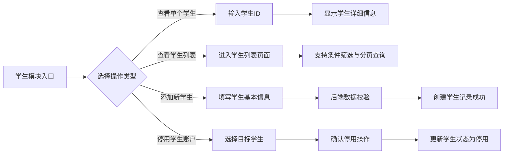

# 学生模块功能设计

> 本模块旨在实现学生信息管理功能，包括查看单个学生信息、查询学生列表、添加新学生以及停用学生账户。通过规范的学生信息管理流程，确保数据准确，满足教学管理系统对学生信息管理的需求。

## 学生与系统的关系

1. **系统角色定位**  
   在教学管理系统中，学生模块负责管理学生基本信息、课程选课、成绩查询等操作，是连接学生与各教学资源的重要纽带。
   
2. **学生信息关联**  
   - **班级/专业归属**：每个学生必须归属于特定班级或专业，系统需维护班级与学生之间的关联关系。  
   - **课程选课记录**：学生选课情况将与课程信息进行关联，便于后续排课及成绩统计。  
   - **成绩管理**：学生的考试成绩、课程表现等均需在系统中进行存储与查询，支持多维度统计分析。

## 学生功能描述

1. **查看单个学生信息**  
   - 根据学生 ID 查询详细信息，包括姓名、联系方式、所属班级、学号、选课记录及成绩等。  
   - 展示信息应详尽清晰，便于教师和管理人员快速了解学生情况。

2. **查看学生列表**  
   - 支持分页查询和条件筛选（如按班级、姓名、学号等条件）功能；  
   - 列表中显示基本信息，用户可点击进入详情页面查看完整数据。

3. **添加新学生**  
   - 提供添加学生的接口和页面，需填写基本信息（姓名、学号、联系方式、班级、专业等）；  
   - 后端对提交数据进行格式、完整性和唯一性校验；  
   - 新增学生默认状态为“启用”，并记录创建时间、创建人等信息。

4. **停用学生账户**
   - 适用于已注册学生（即学生已在系统中创建了账号）的情况；
   - 停用操作需要二次确认，防止误操作；
   - 停用后，该学生账户将无法被删除，仅保留数据用于统计和审计。

5. **删除学生**
   - 仅适用于未注册学生（即仅由教务系统导入的学生信息，无学生账号创建记录）的情况；
   - 对于未创建学生账号的记录，允许直接调用删除接口进行物理删除；
   - 如果学生已注册并创建了账号，则不允许执行删除操作，必须通过停用账户的方式管理。

## 功能流程图

以下使用 Mermaid 语法绘制了学生模块的功能流程图，展示各功能操作之间的逻辑关系：

