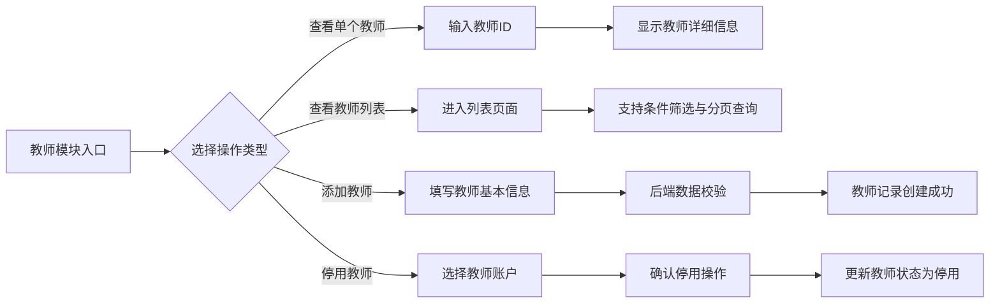

# 教师模块功能设计

> 本模块旨在实现教师管理功能，包括查看单个教师信息、查询教师列表、添加新教师以及停用教师账户，确保教师信息管理规范、准确，并为教务系统的课程排课提供有力支持。
>
> 注意：该部分文档还没有具体完善，后续涉及具体排课需求还会完善文档。

## 教师与本系统的关系

1. **系统角色定位**  
   教务系统主要用于学校的课程排课管理，涉及到用户信息、学校信息、学院信息以及教师信息等多个数据模块。
   
2. **教师信息关联**  
   - **部门归属**：每位教师必须归属于某个部门，该部门可能为学院或其他内部部门。  
   - **课程排课**：教师在排课系统中承担着指定课程的授课任务，同时需要管理自己的排课情况。  
   - **排课限制**：系统需要记录教师是否存在空闲、不可排课或因其他原因暂停排课的情况。

## 教师功能描述

1. **查看单个教师信息**  
   - 根据教师 ID 查询教师详细信息，包括姓名、联系方式、所属部门、资历、授课记录、科研成果等数据。  
   - 提供详细的教师信息展示，便于后续排课及绩效评估。

2. **查看教师列表**  
   - 支持分页查询，方便在教师数量较多时快速定位目标信息；  
   - 支持按部门、姓名、状态等多种条件进行筛选和排序；  
   - 列表展示基础信息，并可点击查看详细信息。

3. **添加新教师**  
   - 提供标准的添加教师接口和页面，需填写基本信息（姓名、工号、联系方式、部门、职称等）；  
   - 后端对提交数据进行格式、完整性及唯一性校验；  
   - 添加后默认状态为“启用”，并记录创建时间、创建人等信息。

4. **停用教师账户**
   - 适用于已注册教师（即教师已在系统中创建了账号）的情况；
   - 停用操作需要二次确认，防止误操作；
   - 停用后，该教师账户将被禁用，但保留数据用于后续统计和审计，不允许被删除。

5. **删除教师记录**
   - 仅适用于未注册教师（即仅由教务系统导入的教师信息，无教师账号创建记录）的情况；
   - 对于未创建教师账号的记录，允许直接调用删除接口进行物理删除；
   - 如果教师已注册并创建了账号，则不允许执行删除操作，只能通过停用账户的方式管理。

## 功能流程图

以下使用 Mermaid 语法绘制了教师模块的功能流程图，以展示各功能操作间的关系：

