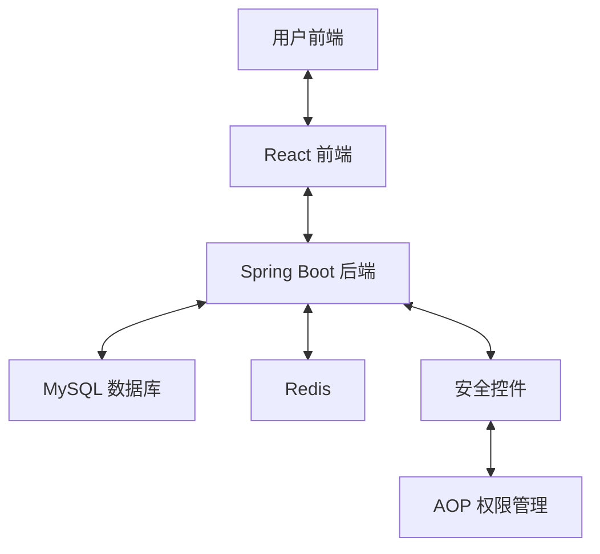
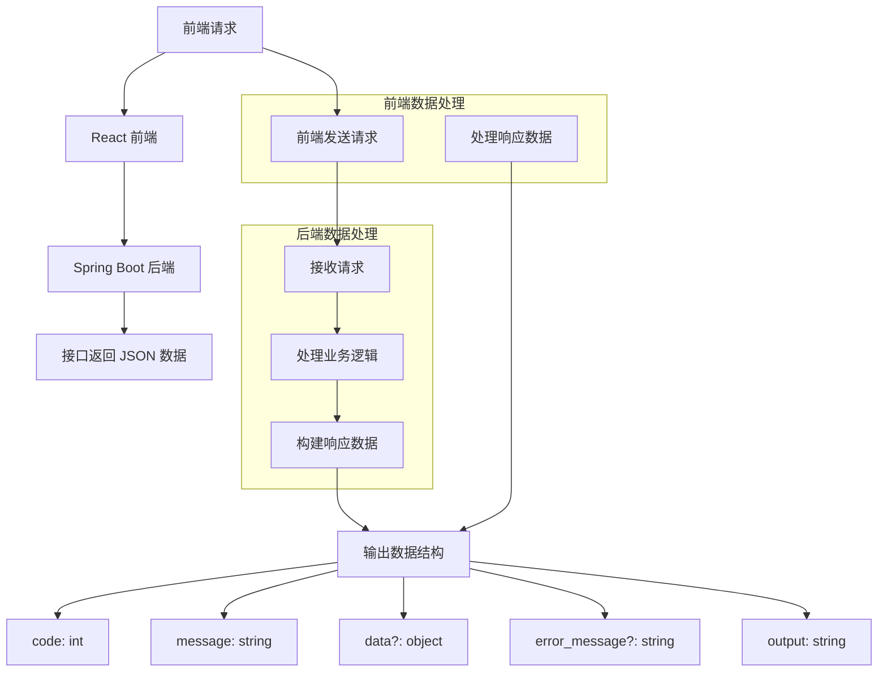

# 技术架构设计

## 1. 系统架构概述

该系统采用前后端分离的架构，前端使用 **React** 框架，后端使用 **Spring Boot** 构建 RESTful API。前后端通过 HTTP 协议进行交互，数据交换格式为 JSON。系统的核心功能包括智能排课、实时冲突检测、多维数据分析和个性化设置等。

### 架构图

#### 过程走向

#### JSON 数据对接

## 2. 技术选型

### 2.1 前端技术

- **React**：采用 React 构建单页面应用（SPA），确保良好的用户体验与交互性能。
- **Tailwind CSS**：使用 Tailwind CSS 进行样式管理，提高开发效率并保持代码简洁。
- **Redux**：用于状态管理，确保前端应用的高效数据流动与状态一致性。
- **Axios**：用于与后端 API 进行 HTTP 请求，支持异步请求与响应处理。

### 2.2 后端技术

- **Spring Boot**：后端使用 Spring Boot 框架，简化了 Spring 应用的配置和部署，提供了高效的 RESTful API 支持。
- **类OAuth2**：用于实现身份认证与权限管理。
- **Mybatis**：用于数据持久化操作，简化数据库操作，支持与 MySQL 的集成。
- **Redis**：用于缓存和会话管理，提高系统性能和响应速度。

### 2.3 数据库

- **MySQL**：采用 MySQL 作为关系型数据库存储系统中的重要数据，如用户信息、课程安排等。
- **Redis**：用于缓存处理，减少数据库查询次数，提升性能。
- **MybatisPlus**：简化与数据库的交互，通过实体映射管理数据库表。

### 2.4 安全与认证

- **Token 令牌认证**：使用 Redis 存储生成的 UUID 令牌来实现用户身份认证。用户登录成功后，系统会生成一个唯一的 UUID 作为 Token，并将该 Token 存储在 Redis 中，设置过期时间。当 Token 在 Redis 中过期时，用户的登录状态将失效，需重新登录。
- **AOP（面向切面编程）**：使用 AOP 技术进行动态权限控制，确保只有具有足够权限的用户才能访问特定功能。

## 3. 系统组件设计

### 3.1 前端模块

1. **首页模块**：展示系统的概况，提供导航功能。
2. **排课模块**：用户可进行课程的智能排课，设置课程时间、地点等。
3. **冲突检测模块**：实时监控排课冲突，确保课程安排不会重叠。
4. **数据分析模块**：展示教学资源的利用情况，支持按学期、按教师等多维度的分析。
5. **用户管理模块**：提供用户注册、登录、权限管理等功能。

### 3.2 后端模块

1. **用户认证模块**：实现用户的登录验证与 JWT 认证。
2. **排课逻辑模块**：实现基于智能算法（如遗传算法）的排课功能。
3. **课程数据管理模块**：提供对课程数据的增、删、改、查操作。
4. **冲突检测模块**：实现课程冲突检测与自动调整功能。
5. **数据统计模块**：为管理员提供多维度的数据分析和报表功能。

## 4. 数据流与模块交互

系统的主要数据流如下：

1. 用户通过前端输入课程安排信息，前端通过 Axios 将数据发送至后端。
2. 后端使用智能算法（如遗传算法）进行排课，并返回排课结果。
3. 若出现冲突，后端将返回冲突信息，前端展示给用户。
4. 用户的操作和结果会实时保存至数据库，并在需要时通过 Redis 进行缓存。

### 模块间交互示意
- **前端与后端**：通过 RESTful API 进行交互。
- **后端与数据库**：通过 Spring Data JPA 进行持久化操作，使用 MySQL 存储数据，使用 Redis 缓存数据。
- **后端与安全模块**：通过 Spring Security 和 JWT 实现认证与授权，确保用户的身份安全。

## 5. 性能与扩展性

### 5.1 性能优化

- **Redis 缓存**：通过 Redis 对热点数据进行缓存，减少数据库的压力。
- **异步处理**：对于一些耗时的操作（如排课），采用异步任务处理，提升用户体验。
- **负载均衡**：使用负载均衡策略，确保在高并发情况下系统的稳定运行。

### 5.2 可扩展性

- **模块化设计**：各模块之间的耦合度低，便于后期功能扩展和修改。
- **微服务架构**：未来可根据需要将部分模块拆分为独立的微服务，支持按需扩展。
- **云原生部署**：系统架构可以支持容器化部署，利用 Kubernetes 实现自动化的服务部署和管理。

## 6. 安全性设计

- **身份认证**：用户登录后会通过 JWT 获取认证令牌，所有后续请求都必须携带此令牌。
- **权限控制**：使用 AOP 技术进行权限切面管理，确保不同角色用户只能访问他们权限范围内的功能。
- **数据加密**：所有敏感数据（如用户密码）使用加密算法存储，确保数据的安全性。

## 7. 总结

该技术架构设计注重高效、可扩展和安全性，通过前后端分离的架构设计，能够更好地满足项目需求并支持未来扩展。各模块的技术选型和设计充分考虑了项目的高性能、易维护性以及用户体验。