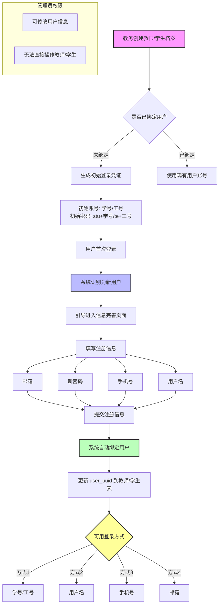

# 教师（学生）与用户关系说明

## 系统关系特点

1. 教师和学生数据表与用户表**没有必然的直接关系**
2. 可由具有教务权限的用户创建、修改、删除教师和学生信息（若未绑定用户）
3. 支持批量添加教师和学生信息

## 角色权限说明

| 角色 | 用户管理权限 | 教师/学生管理权限 |
|------|--------------|-------------------|
| 管理员 | 完全权限 | 有限权限 |
| 教务 | 无权限 | 完全权限 |

## 数据库设计原则

### 关键表结构
- `cs_user`：用户基本信息表
- `cs_teacher`：教师信息表
- `cs_student`：学生信息表

### 外键关联特点
- `user_uuid` 外键默认允许为空
- 空值表示教师或学生尚未在系统中注册

## 初始登录机制

### 登录凭证
```json
{
    "user": "学号或工号",
    "pass": "stu+学号 / te+工号"
}
```

### 首次登录流程
1. 使用初始账号密码登录
2. 系统识别为新用户
3. 引导进入信息完善页面（`/api/v1/auth/registered`）

### 注册信息结构
```typescript
export type Request = {
    type: boolean;           // 系统自动填入的类型
    name: string;            // 系统自动填入的学号
    email: string;           // 用户填写的邮箱
    new_password: string;    // 用户设置的新密码
    phone: string;           // 用户填写的手机号码
    user: string;            // 用户填写的用户名
}
```

## 登录方式转变
- 初始：仅使用学号/工号登录
- 注册后：可使用以下方式登录
  1. 学号/工号
  2. 用户名
  3. 手机号
  4. 邮箱

## 用户绑定机制

### 自动绑定流程
1. 用户完成信息注册
2. 系统自动获取新建 `cs_user` 的 `user_uuid`
3. 将 `user_uuid` 存入对应的 `cs_teacher` 或 `cs_student` 表

### 特点
- 无需管理员或教务手动干预
- 全程由系统程序自动执行

## 后续管理

### 错误处理
- 管理员可修改用户信息
- 教务无权操作用户账号
- 最终用户管理权限仍归管理员所有

## 安全性考虑
1. 初始密码为临时密码
2. 必须在首次登录时更改
3. 用户信息修改受严格权限控制

## 流程图

