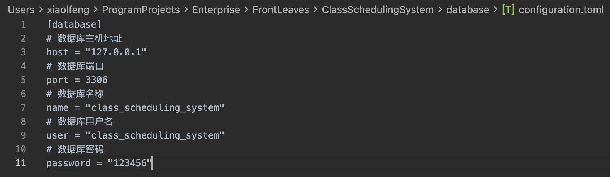

# 关系型数据库准备

> **说明**：本文档主要指导 MySQL 数据库的安装与初始化配置，以确保环境满足系统运行需求。

## 数据库版本要求

- **支持版本**：MySQL 8.0 及以上版本（不支持 MySQL 9.0 及其之后版本）。
- **推荐使用场景**：开发与生产环境。

## 数据库安装

<div style="color: lightblue;">若已安装 MySQL 数据库程序，可跳过此部分。</div>

本文不详细描述 MySQL 数据库的安装过程，推荐使用 Docker 部署以简化配置。

### 使用 Docker 安装 MySQL

1. 打开命令行终端，输入以下命令以拉取并启动 MySQL 容器：

    `docker run --name <ContainerName> -p 3306:3306 -e MYSQL_ROOT_PASSWORD=<YourPassword> -d mysql:8.4.3`

    **参数说明**：

    - `<ContainerName>`：容器名称，自定义命名，例如 `MySQL_8`。
    - `<YourPassword>`：MySQL `root` 用户密码，自定义密码，例如 `123456`。

2. 验证容器是否成功运行：

    `docker ps`

    若容器未正常启动，可通过以下命令检查错误日志：

    `docker logs <ContainerName>`

## 数据库管理工具（可选项）「推荐」

为便于数据库管理，推荐使用 PHPMyAdmin 作为图形化管理工具。

### 使用 Docker 部署 PHPMyAdmin

1. 在命令行输入以下命令以启动 PHPMyAdmin 容器：

    `docker run --name <ContainerName> -d -e PMA_ARBITRARY=1 -p <YourPort>:80 phpmyadmin`

    **参数说明**：

    - `<ContainerName>`：容器名称，自定义命名，例如 `phpmyadmin`。
    - `<YourPort>`：映射到本地的端口，例如 `8080`。

2. 在浏览器中访问 `http://localhost:<YourPort>`，即可打开 PHPMyAdmin 管理页面。

## 数据库初始化

### 获取 MySQL 容器的 IP 地址

1. 在 Docker Desktop 中选择已启动的 MySQL 容器，点击 `Inspect`，找到 `Network` 中的 `IPAddress`。

    **说明**：`IPAddress` 是 MySQL 容器的内部网络地址，后续将用于连接数据库。

    

### 配置 PHPMyAdmin 登录

1. 打开 PHPMyAdmin 页面，在 **服务器** 栏中输入 MySQL 容器的 `IPAddress`。
2. 填写用户名和密码：
    - 用户名：`root`
    - 密码：您在 Docker 部署 MySQL 时设置的 `<YourPassword>`

    

3. 登录成功后，点击 `账户` 菜单，选择 `新增用户账户` 以创建新用户。

    

4. 配置用户信息：
    - 用户名：自定义用户名，例如 `class_scheduling_system`。
    - 密码：自定义密码，例如 `123456`。
    - 勾选选项：创建与用户同名的数据库并授予所有权限。

    完成配置后点击 `执行` 按钮。

    

## 数据库 CLI 工具

### 下载 CLI 工具

- **下载地址**：[class-scheduling-system/table-install-cli](https://github.com/class-scheduling-system/table-install-cli/releases)
- **选择版本**：根据操作系统和架构选择对应版本。
    - **Arm64 架构**：下载 arm64 程序。
    - **X86_64 架构**：下载 amd64 程序。

### 配置 CLI 工具

1. 下载完成后，将程序文件放置到本地指定位置。
2. 在终端中执行以下命令以生成默认配置文件：

    `./cli-<YourComputerSystem>-<Architecture>[.exe]`

    **参数说明**：

    - `<YourComputerSystem>`：操作系统名称，例如：
        - `linux`：表示 Linux 系统。
        - `windows`：表示 Windows 系统。
        - `macos`：表示 macOS 系统。
    - `<Architecture>`：系统架构，例如：
        - `arm64`：适用于 ARM64 架构。
        - `amd64`：适用于 X86_64 架构。
    - `[.exe]`：仅在 Windows 系统中使用，Linux 和 macOS 不需要。

3. 打开生成的 `configuration.toml` 配置文件，确认配置是否正确。

    **注意**：若操作步骤与上述示例一致，默认配置通常无需修改。

    

### 测试连接

1. 在终端中执行以下命令测试数据库连接：

    `./cli-<YourComputerSystem>-<Architecture>[.exe] conn`

    **参数说明**：

    - `conn`：CLI 提供的子命令，用于测试与数据库的连接是否成功。

2. 如果返回 `数据库连接成功`，则表示配置无误。
3. 如果返回错误信息，请根据提示进行排查。

## 注意事项

- 确保 MySQL 和 PHPMyAdmin 容器均正常运行。
- 不要使用过于简单的密码以保证数据安全。
- 使用 CLI 工具时，请保持工具版本与系统兼容。

## 结语

数据库安装与配置教程到此结束。如需初始化数据库全部内容，可使用 CLI 提供的一键初始化功能：

```shell
./cli-<YourComputerSystem>-<Architecture>[.exe] help
```

请根据需求查阅工具使用方法，完成后续配置与管理。