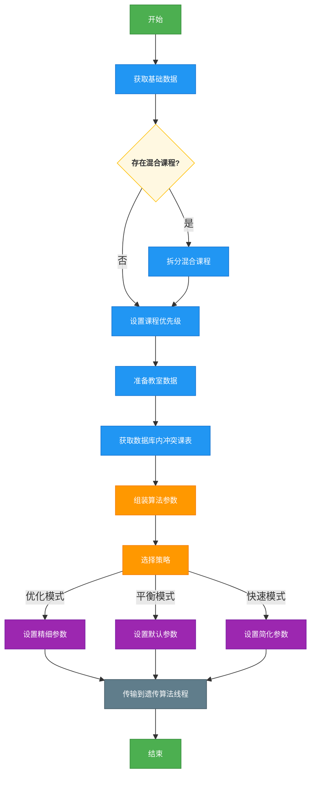
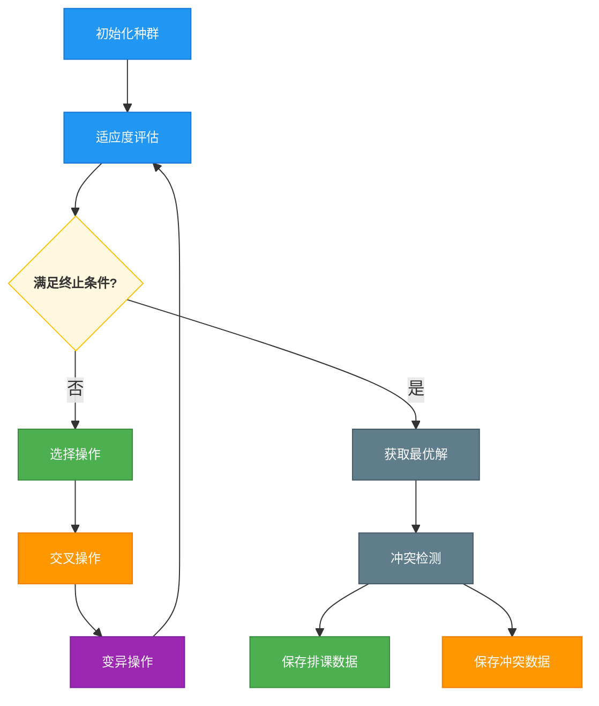

# 核心算法文档

## 1. 算法概述

### 1.1 算法介绍

本系统使用遗传算法（Genetic Algorithm, GA）实现智能排课功能。遗传算法是一种模拟自然选择和遗传机制的优化算法，通过不断迭代、进化，寻找最优解或较优解。在排课系统中，遗传算法能够有效处理多约束条件下的复杂排课问题，生成满足各类约束的课程表。

### 1.2 算法简要逻辑

1. ​**数据输入阶段**​
    - 前端提交排课约束条件（课程、教师、教室、时间等）
    - 后端接收并预处理数据，生成排课问题域
2. ​**种群初始化**​
    - 随机生成初始种群（多个候选课表）
    - 每个个体表示一种排课方案（教室、教师、时间槽的合法组合）
3. ​**适应度评估**​
    - 对每个个体进行约束检测和评分
    - 计算冲突数（如教师时间冲突、教室占用冲突等）
    - 根据冲突情况计算适应度值（冲突越少，适应度越高）
4. ​**迭代优化阶段**​
    - 选择（Selection）
      - 采用轮盘赌选择法，优先保留高适应度个体
      - 适应度越高的个体被选中的概率越大
    - 交叉（Crossover）
      - 从父代中选择两个个体，交换部分课程安排
      - 生成新的子代个体，保留优质基因
    - 变异（Mutation）
      - 随机调整部分课程的时间或教室分配
      - 引入多样性，避免早熟收敛
5. ​**结果输出阶段**​
    - 记录迭代过程中的最优解
    - 最终输出冲突最少的排课方案（适应度最高的）
    - 保存无法避免的冲突

## 2. 核心组件与数据结构

### 2.1 主要数据模型

| 数据模型名称                    | 数据模型简介                                               |
| ------------------------------- | ---------------------------------------------------------- |
| AutomaticClassSchedulingBaseDTO | 表示后端准备数据结束后生成的算法所需所有数据               |
| ScheduleDTO                     | 表示一个完整课程表的解决方案，包含课程安排列表和适应度值。 |
| CourseScheduleDTO               | 单个课程的排课方案，包含时间槽与课程安排项的映射。         |
| CourseScheduleItemDTO           | 具体的课程安排项，包含课程、教师、教室、班级等信息。       |
| TimeSlotDTO                     | 时间槽，表示第几周、星期几、第几节课。                     |

### 2.2 关键工具类

| 工具类名称                | 工具类简介                                                 |
| ------------------------- | ---------------------------------------------------------- |
| ClassroomSelectionUtil    | 教室选择工具类，负责根据课程要求和学生人数选择合适的教室。 |
| ScheduleFitnessCalculator | 适应度计算工具类，评估课程表的质量。                       |
| TimeSlotGeneratorUtil     | 时间槽生成工具类，生成符合要求的时间安排。                 |
| CheckConflicts            | 冲突检测工具类，检查各种资源冲突。                         |

### 2.3 算法接口

| 接口名称                         | 接口简介                                                 |
| -------------------------------- | -------------------------------------------------------- |
| GenerateInitialPopulationService | 初始化种群，根据要求初始化符合要求的种群                 |
| EvaluatePopulationService        | 评估种群，根据要求计算种群的适应度                       |
| IterateService                   | 进化迭代，根据要求对各个种群进行选择，交叉与变异         |
| BaseGeneticSchedulingLogic       | 基础算法，包括冲突检测，根据排课结果创建返回值保存到数据 |

## 3. 算法流程

### 3.1 数据准备阶段 (ScheduleLessonsDataPreparationThread)



### 3.2 遗传算法执行 (AutomaticClassSchedulingThread)



## 4. 关键算法实现

### 4.1 种群初始化(GenerateInitialPopulationService)

通过基础数据，对需要排课的每一门课进行初次随机分配：

- 优先对每一门课进行分班处理，由于可能存在一门课的人数过多，若未限定行政班，算法将会根据人数进行分配，最小为30人一个教学班，最大为所选教室最大容量人数分配教学班，如果超过最大容量人数则进行随机分配班级，始终保持教学班人数为30-最大人数之间；若限定行政班级，算法将会优先按照专业一样的班级进行分班，专业一样的班级优先为一个教学班，若人数少于30或超过最大人数则进行二次分班，始终保持由行政把你组成教学班人数为30-最大人数人之间。
- (ClassroomSelectionUtil) 为每一个教学班级随机分配一个符合要求的教室，符合人数大小（教室容量大于教学班人数）的，符合课程安排的教室，若基础数据为没有符合的教室，则会优先分配一个人数尽可能符合的教室，若还不存在，则随机分配一个人数尽可能符合的教室，保证每一个教学班都有教室上课。
- 为每一个教学班级随机分配一个老师，根据基础数据获取符合有教学资格的老师（必定存在），通过随机数的分配，随机选择一个老师为这一个教学班级进行上课。
- 以上数据会被存到CourseScheduleItemDTO中作为这门课的基础信息。
- (TimeSlotGeneratorUtil)为每一教学班级分配上课时间槽，根据基础数据中周学时来为课程分配时间槽，根据周学时来自动分配每周上课时间槽，在周学时为奇数的情况下，系统会自动生成单双周补课时间槽（由用户定义单双周），在此基础上生成时间槽列表，存放到CourseScheduleDTO组成一门课程安排。

### 4.2 适应度评估规则

#### 4.2.1 冲突检测

- ​**教师冲突检测**​: 同一教师同一时间分配多门课程：每处-100分
- ​**教室冲突检测**​: 同一教室同一时间分配多门课程：每处-100分
- ​**班级冲突检测**​: 同一班级同一时间分配多门课程：每处-100分

#### 4.2.2 时间偏好

- ​**偏好时间段**​  
  符合教师/班级偏好：每节+10分
- ​**非偏好时间段**​  
  ▸ 非期望晚课：每节-5分  
  ▸ 非期望早课：每节-3分

#### 4.2.3 课程连续性

- ​**连续课程奖励**​  
  同班级连续2+节相同课程：(节数-1)×5分
- ​**课程间隔要求**​  
  理论/实践课间隔不足1天：每处-5分

#### 4.2.4 教室优化

- ​**容量匹配**​  
  ▸ 70-90%利用率：+5分  
  ▸ >90%利用率：+10分  
  ▸ <70%利用率：-5分
- ​**类型匹配**​  
  符合课程需求：+10分  
  不符合需求：-5分

#### 4.2.5 教师偏好

- ​**时间段偏好**​  
  ▸ 非常期望：+10分/节  
  ▸ 较期望：+5分/节  
  ▸ 可接受：0分  
  ▸ 尽量避免：-5分/节  
  ▸ 最不期望：-10分/节

#### 4.2.6 适应度计算公式

```
适应度 = 基准分(1000)
      - (教师冲突数 × 100)
      - (教室冲突数 × 100)
      - (班级冲突数 × 100)
      + (偏好时间段匹配数 × 10)
      - (非偏好晚课数 × 5)
      - (非偏好早课数 × 3)
      + (连续课程组数 × (课程数-1) × 5)
      - (不合理间隔数 × 5)
      + Σ教室容量加分（按利用率区间）
      + Σ教室类型匹配分（+10或-5）
      + Σ教师偏好分（按偏好级别）
```

### 4.3 选择、交叉与变异 (IterateService)

- **选择操作**：使用轮盘赌选择法，适应度高的个体有更大概率被选中。
- **交叉操作**：将两个父代解决方案的部分课程安排进行交换，生成新的解决方案。
- **变异操作**：随机改变部分课程的时间槽或教室分配，以增加种群多样性。

### 4.4 冲突检测 (BaseGeneticSchedulingLogic)

- **时间冲突检测**：检查相同时间槽是否有资源冲突。
- **教师冲突**：同一教师不能同时出现在不同地点授课。
- **教室冲突**：同一教室不能同时安排多门课程。
- **班级冲突**：同一班级不能同时上不同课程。

## 5. 算法优化策略

### 5.1 三种排课策略

系统提供三种排课策略，通过调整算法参数实现不同的优化目标：

- **优化策略**：种群大小200，最大迭代次数1000，交叉率0.8，变异率0.1。
  - 注重排课质量，生成最优解，但耗时较长。
- **平衡策略**：种群大小100，最大迭代次数500，交叉率0.7，变异率0.2。
  - 在时间和质量之间取得平衡。
- **快速策略**：种群大小50，最大迭代次数200，交叉率0.6，变异率0.3。
  - 快速生成可接受的解决方案，适合临时排课。

### 5.2 多约束条件优化

系统支持多种约束条件的组合优化：

- **教师偏好考虑**：尊重教师的时间偏好设置。
- **教室优化**：合理分配教室资源，提高利用率。
- **学生冲突避免**：避免同一班级在同一时间段有多门课程。
- **连续课程优先**：优先安排连续课程，减少碎片时间。
- **专业教室匹配**：根据课程类型分配对应的专业教室。
- **时间槽单双周分配**: 根据奇数周学时自动分配单双周补课。

## 6. 遗传算法总体数学公式

### 6.1 初始化种群

设种群规模为 N，每个个体表示一个排课方案，用染色体 Xi​ 表示：

$$
P^{(0)} = \{ \mathbf{X}_1^{(0)}, \mathbf{X}_2^{(0)}, \dots, \mathbf{X}_N^{(0)} \}
$$

其中：

- $\mathbf{X}_i^{(0)}$：第 $i$ 个初始个体，表示一个完整课表方案
- $P^{(0)}$：初始种群集合

### 6.2 适应度函数

$$
f_i^{(t)} = \text{Fitness}(\mathbf{X}_i^{(t)})
$$

其中：

- $\mathbf{X}_i^{(t)}$：第 $t$ 代第 $i$ 个个体（染色体）
- $f_i^{(t)}$：对应的适应度函数值
- $\text{Fitness}(\cdot)$：适应度评估函数

### 6.3 选择操作

采用轮盘赌策略选择个体时，每个个体 $\mathbf{X}_i^{(t)}$ 的被选概率为：

$$
\text{Prob}(\mathbf{X}_i^{(t)}) = \frac{f_i^{(t)}}{\sum_{j=1}^N f_j^{(t)}}
$$

其中：

- $f_i^{(t)}$：第 $i$ 个个体的适应度值
- $N$：种群规模
- 分母为当代所有个体适应度之和
- 选出的交配池表示为：

$$
M^{(t)} = \{ \mathbf{X}_{s_1}^{(t)}, \mathbf{X}_{s_2}^{(t)}, \dots, \mathbf{X}_{s_K}^{(t)} \}
$$

其中 $s_1, \dots, s_K$ 是通过轮盘赌选出的个体索引（允许重复选择）

### 6.4交叉操作数学表示

从交配池 $M^{(t)}$ 中成对选择个体进行交叉：

$$
(\mathbf{X}_i^{(t)}, \mathbf{X}_j^{(t)}) \xrightarrow{\text{crossover}} (\mathbf{X}_i^{(t+1)}, \mathbf{X}_j^{(t+1)})
$$

其中：

- 交叉概率 $p_c \in (0,1]$ 控制操作执行频率
- 交叉策略可采用：
  - ​**单点交叉**​：随机选择切点 $k$，交换切点后基因段
    $$
    \begin{aligned}
    \mathbf{X}_i^{(t+1)} &= [g_{i1}, \dots, g_{ik}, g_{j(k+1)}, \dots, g_{jm}] \\
    \mathbf{X}_j^{(t+1)} &= [g_{j1}, \dots, g_{jk}, g_{i(k+1)}, \dots, g_{im}]
    \end{aligned}
    $$
  - ​**排课专用交叉**​（示例）：
    - 按课程类型交换时间块
    - 保留教师-课程匹配关系交换教室分配 4. 交叉操作（Crossover）

### 6.5对子代个体进行变异操作：

$$
\mathbf{X}_k^{(t+1)} \xrightarrow{\text{mutation}} \mathbf{X}_k^{\prime(t+1)}
$$

其中：

- 变异概率 $p_m \in [0,1)$ 控制变异强度
- 常用变异策略：
  - ​**时间微调**​：随机调整课程时间槽 $\tau \sim \mathcal{U}\{1, T\}$
    $$ g\_{kl}^{\prime} = (r_k, t_k \pm \Delta t, c_k) $$
  - ​**教室替换**​：在合规教室集合中随机选择
    $$ g*{kl}^{\prime} = (r_k, t_k, c_k^{\prime}), \quad c_k^{\prime} \in \mathcal{C}*{\text{valid}} $$

### 6.6 新一代种群构建

$$
P^{(t+1)} = \text{SelectBest}\left(P^{(t)} \cup \text{Offspring}^{(t+1)}\right)
$$

其中：

- $\text{Offspring}^{(t+1)}$ 表示通过交叉和变异产生的新个体集合
- $\text{SelectBest}(\cdot)$ 为选择函数，通常保留：
  - 前代最优个体（精英保留）
  - 适应度最高的 $N$ 个个体（$N$ 为种群规模）

### 6.7 收敛判断

$$
\text{Terminate if: } t \geq T_{\text{max}} \text{ or } f^* \geq f_{\text{threshold}}
$$

其中：

- $T_{\text{max}}$：最大迭代次数（如 500 代）
- $f^* = \max \{ f(\mathbf{X}) | \mathbf{X} \in P^{(t)} \}$：当前种群最优适应度
- $f_{\text{threshold}}$：预设目标适应度阈值（如 950 分）

### 6.8 遗传算法流程

1. ​**初始化**​：
   - 生成初始种群 $P^{(0)} = \{ \mathbf{X}_1^{(0)}, \dots, \mathbf{X}_N^{(0)} \}$
   - 设置参数：$p_c$, $p_m$, $T_{\text{max}}$, $f_{\text{threshold}}$
2. ​**迭代优化**​（$t = 0$ to $T_{\text{max}}$）：

   - ​**适应度评估**​：
     $$ f_i^{(t)} = \text{Fitness}(\mathbf{X}\_i^{(t)}), \quad \forall \mathbf{X}\_i \in P^{(t)} $$
   - ​**选择**​：
     $$ M^{(t)} = \text{Select}(P^{(t)}, f^{(t)}) $$
   - ​**交叉**​（概率 $p_c$）：
     $$ \forall (\mathbf{X}\_i, \mathbf{X}\_j) \in M^{(t)}, \quad (\mathbf{X}\_i, \mathbf{X}\_j) \xrightarrow{\text{crossover}} (\mathbf{X}\_i', \mathbf{X}\_j') $$
   - ​**变异**​（概率 $p_m$）：
     $$ \forall \mathbf{X}\_k \in \text{Offspring}, \quad \mathbf{X}\_k \xrightarrow{\text{mutation}} \mathbf{X}\_k' $$
   - ​**新一代种群**​：
     $$ P^{(t+1)} = \text{NextGeneration}(P^{(t)}, \text{Offspring}^{(t+1)}) $$

3. ​**终止条件**​（满足任一即停止）：

   - $t \geq T_{\text{max}}$
   - $f^* \geq f_{\text{threshold}}$

4. ​**输出**​：
   $$
   \mathbf{X}^* = \underset{\mathbf{X} \in P^{(t)}}{\text{argmax}} f(\mathbf{X})
   $$

## 7.算法输出结果

### 7.1 排课结果

- **课程安排列表**：详细的课程安排信息，包括课程、教师、教室、时间等。
- **冲突信息**：如果存在无法避免的冲突，会记录冲突详情。
- **资源利用率**：包括教室利用率、教师工作量分布、时间槽使用率等。

### 7.2 数据持久化

- 将排课结果保存到数据库中的课程安排表和教学班表。
- 记录排课过程中的冲突情况，便于管理员后续处理。
- 临时保存排课结果到Redis缓存，支持查看，便于用户查看结果

## 8. 算法优势与特点

### 8.1 特点

1. **多约束条件支持**：同时处理教师、教室、班级等多种资源约束。
2. **灵活的策略选择**：提供多种排课策略，满足不同场景需求。
3. **教室资源优化**：根据课程类型和学生人数智能分配教室。
4. **冲突处理机制**：识别并记录无法避免的冲突，辅助人工决策。
5. **时间偏好支持**：考虑教师和管理员的时间偏好设置。
6. **连续课程优化**：优先安排连续课程，提高教学效果和资源利用率。
7. **单双周排课**：支持单周、双周排课的特殊情况处理。

### 8.2 与原始普通遗传算法的比较优势

在本系统中，所采用的改进型遗传算法在标准遗传算法的基础上进行了多方面优化，主要包括适应度函数设计、选择算子优化以及局部搜索策略的引入。与原始普通遗传算法相比，改进算法在收敛速度、排课质量以及冲突控制等方面表现更为优异。

首先，原始遗传算法通常仅以课表冲突数作为适应度评估标准，容易陷入局部最优，无法充分考虑教师偏好、课程分布均衡等软约束。而本系统引入了多目标适应度函数，将软硬约束权重综合考虑，使算法的搜索方向更具引导性。

其次，在选择和变异操作方面，传统算法常采用轮盘赌选择和简单单点变异，易造成种群早熟或多样性丧失。本系统则引入了精英保留策略与局部微调操作，在保持解多样性的同时加快了收敛速度。

实验结果表明，在相同规模的数据集下，改进遗传算法在平均适应度、收敛代数和冲突数量等指标上均优于原始算法，尤其是在复杂约束条件下表现更为稳定可靠。

## 9.算法总结

### 9.1 算法目标

本实验旨在构建一个智能排课系统，能够在多个现实约束条件下（如教师时间、教室容量、班级冲突等）生成尽可能优化的课程安排方案。系统采用**遗传算法（Genetic Algorithm, GA）**，通过模拟生物进化过程，逐代优化课程表，提高整体排课质量和资源利用率。

### 9.2 算法核心思路

遗传算法将每一个课程表视为一个“染色体”，通过初始化、适应度评估、选择、交叉和变异等步骤进行进化，逐步逼近最优解。其核心流程包括：

1. **种群初始化**：根据课程、教师、班级、教室等信息，随机生成一组初始可行排课方案。
2. **适应度评估**：通过冲突检测、时间偏好、连续性、教室匹配等规则，打分每个方案的排课质量。
3. **选择操作**：采用轮盘赌算法，保留适应度高的个体，增强优良基因的继承。
4. **交叉操作**：在高适应度个体之间交换部分课程安排，提升局部结构的优化。
5. **变异操作**：随机变动部分课程的时间或教室，增加种群多样性，防止陷入局部最优。
6. **终止判断**：当达到设定迭代次数或个体适应度趋于稳定时，终止进化过程，输出最优方案。

### 9.3关键设计点

- **多因素评分机制**：适应度不仅考虑资源冲突，还结合教师偏好、教室利用率、时间段合理性等进行加权评分。
- **三种策略模式**：根据不同排课场景设定优化参数（快速/平衡/精细），提升实际应用灵活性。
- **时间槽与单双周处理**：自动支持不等周学时课程，通过单双周时间槽生成器合理安排课程。
- **课程自动分班**：支持混合课按行政班或人数自动分班，适应不同教学组织方式。
